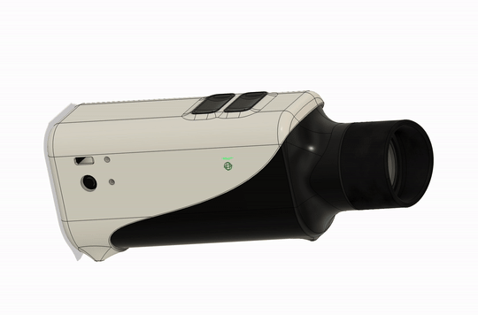
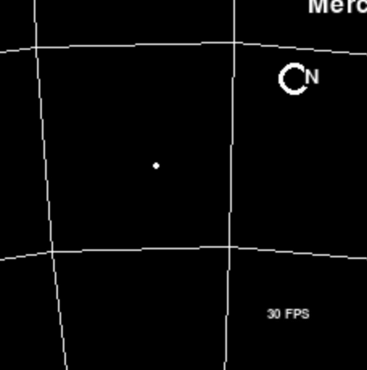

# Starfinder ⭐️ 🔭

Starfinder is a compact augmented reality device. It annotates the night sky to help you identify stars, planets, galaxies, and more.

Starfinder is based on the Raspberry Pi Zero 2 and Pygame. It uses the ICM-20948 9 degrees of freedom chip and [xioTechnology's Fusion Library](https://github.com/xioTechnologies/Fusion/tree/main) which is an implementation of the Madgwick algorithm. With that, it renders and displays an overlay of what you're pointing the starfinder at. With both eyes open and at the natural zoom level you can see the Starfinder's labels over the real stars in the sky!

It has two buttons for zoom, USB C charging, and a power button. The 1.2 inch cicular LCD is behind a lens so your eyes can focus on both stars in the distance and the display at the same time.

